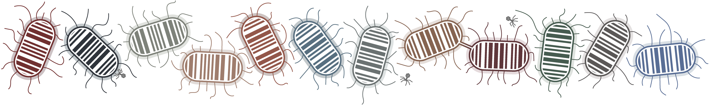

This repository is linked to our paper: [Completing bacterial genome assemblies with multiplex MinION sequencing
](https://sdfosidhfsidfjaosdjiodifjodifjsdof). It involved sequencing 12 isolates of _Klebsiella pneumoniae_ on the Oxford Nanopore MinION using their native barcoding kit. Illumina reads previously existed for each of the isolates, enabling hybrid assembly. In the paper we share our methods, lessons learned and future considerations for using multiplex MinION sequencing to complete bacterial genomes.

This repo contains the scripts used to generate our data and links to the reads and assemblies. If other researchers have different methods for data-preparation or assembly that they would like to share, we are happy to include the results here! You can do a GitHub pull-request with your results or else create an [issue](https://github.com/rrwick/Bacterial-genome-assemblies-with-multiplex-MinION-sequencing/issues) on this repo.

## Bash script

The [ONT_barcode_basecalling_and_assembly.sh](ONT_barcode_basecalling_and_assembly.sh) script carries out the following steps:
* Trimming Illumina reads
* Basecalling Nanopore reads
* Trimming and subsampling Nanopore reads
* Assembling Illumina-only read sets
* Assembling Nanopore-only read sets
* Assembling hybrid read sets
* Polishing Nanopore-only assemblies with [Nanopolish](https://github.com/jts/nanopolish)

Each of these steps can be turned on/off using the variables at the top of the script. Details for some of the steps are described below.

## Illumina read processing

We used [Trim Galore](https://www.bioinformatics.babraham.ac.uk/projects/trim_galore/) to trim adapter sequences from the Illumina reads and remove low-quality sequence. We used a conservative quality threshold of 10 - only removing particularly bad sequences.

## Nanopore read processing

When basecalling Nanopore reads using Albacore (Oxford Nanopore's command-line basecaller), we used the `--barcoding` option to sort the reads into barcode bins. We then ran [Porechop](https://github.com/rrwick/Porechop) on each bin to remove adapter sequences and discard chimeric reads.

Notably, when running Porechop we used its barcode binning as well. This was so we would only keep reads where both Albacore and Porechop agreed on the barcode bin. For example, Albacore put 95064 reads in the bin for barcode 1. Of these reads, Porechop put 90919 in the barcode 1 bin, 118 reads into bins for other barcodes, 3941 reads into no bin and 86 reads were discarded as chimeras. By using only the 90919 reads where Albacore and Porechop agree, we can minimise barcode cross-contamination.

All reads shorter than 2 kbp were discarded for each sample - due to the long read N50s this was a very small proportion of the reads. For samples which still had more than 500 Mbp of reads, we subsampled the read set down to 500 Mbp. This was done using read quality - specifically the reads' minimum qscore over a sliding window. This means that the discarded reads were the one which had the lowest quality regions, as indicated by their qscores. This was done with the `fastq_to_fastq.py` script in [this repo](https://github.com/rrwick/Fast5-to-Fastq).

## Polishing with Nanopolish

We used Nanopolish on the Nanopore-only assemblies to get their base-level accuracy as high as possible. For this step we used all Nanopore reads for which Albacore and Porechop agreed on the barcode bin (before the read sets were subsampled to 500 Mbp). After using `nanopolish extract` to produce a fasta file from Albacore's output directory, we used [this script](nanopolish_read_filter.py) to exclude reads where Porechop disagreed on the bin.

## Error rate estimation

To estimate error rates, we:
* took the 25 largest contigs from Unicycler's Illumina-only assembly
* trimmed 1 kbp off each end
* BLASTed the assemblies using these contigs, keeping only the best hit per contig
* Averaged the error rate over the hits

The code to carry this out is in the [error_rate_estimation](error_rate_estimation) directory.

We used this method because we trust the base calls in an Illumina-only assembly for non-repetitive sequence. By taking only the largest Illumina-only contigs, we avoid repeat sequences. Since these contigs usually end in repeat sequences (repeats being the most common contig-length-limiting feature for Illumina-only assembly), we trim off a kilobase of sequence to ensure our test sequences are not too close to a repeat.

This method for error rate estimation therefore only covers non-repetitive DNA. Error rates in repetitive regions will quite possibly be higher.

## Software versions used

* Albacore: v1.1.2
* [Porechop](https://github.com/rrwick/Porechop): v0.2.1
* [Unicycler](https://github.com/rrwick/Unicycler): [commit 751cdaa](https://github.com/rrwick/Unicycler/tree/751cdaa28c65ffd87ec331d3424a80bc338cfbfa) (a pre-release version of Unicycler v0.4)
* [Canu](http://canu.readthedocs.io/en/latest/): [snapshot v1.5 +54 changes](https://github.com/marbl/canu/tree/f356c2c3f2eb37b53c4e7bf11e927e3fdff4d747)
* [SPades](http://cab.spbu.ru/software/spades/): v3.10.1
* [Pilon](https://github.com/broadinstitute/pilon): v1.22

## Reads per sample

## Assembly commands

SPAdes Illumina-only: `spades.py -1 short_1.fastq.gz -2 short_2.fastq.gz -o out_dir --careful`

SPAdes hybrid: `spades.py -1 short_1.fastq.gz -2 short_2.fastq.gz --nanopore long.fastq.gz -o out_dir --careful`

Unicycler Illumina-only: `unicycler -1 short_1.fastq.gz -2 short_2.fastq.gz -o out_dir`

Unicycler Nanopore-only: `unicycler -l long.fastq.gz -o out_dir`

Unicycler hybrid: `unicycler -1 short_1.fastq.gz -2 short_2.fastq.gz -l long.fastq.gz -o out_dir`

## Results: Illumina-only assemblies

| Assembler | Mean contigs | Mean N50 | Complete plasmids |
| :-----:   | -----------: | -------: | ----------------: |
| SPAdes    |              |          |                   |
| Unicycler |        191.8 |  293,648 |           14 / 57 |

## Results: Nanopore-only assemblies

| Assembler | Mean contigs | Mean N50 | Complete chromosomes | Complete plasmids | Estimated error rate (pre-Nanopolish) | Estimated error rate (post-Nanopolish) |
| :-------: | -----------: | -------: | -------------------: | ----------------: | ------------------------------------: | -------------------------------------: |
| Canu      |              |          |               4 / 12 |           23 / 57 |                                1.249% |                                        |
| Unicycler |              |          |               7 / 12 |           32 / 57 |                                1.029% |                                        |

## Results: hybrid assemblies

| Assembler  | Mean contigs | Mean N50 | Complete chromosomes | Complete plasmids | 100% complete | Estimated error rate |
| :--------: | -----------: | -------: | -------------------: | ----------------: | ------------: | -------------------: |
| SPAdes     |              |          |                      |                   |               |                      |
| Canu+Pilon |              |          |                      |                   |               |                      |
| Unicycler  |              |          |              12 / 12 |           46 / 57 |        7 / 12 |                      |
